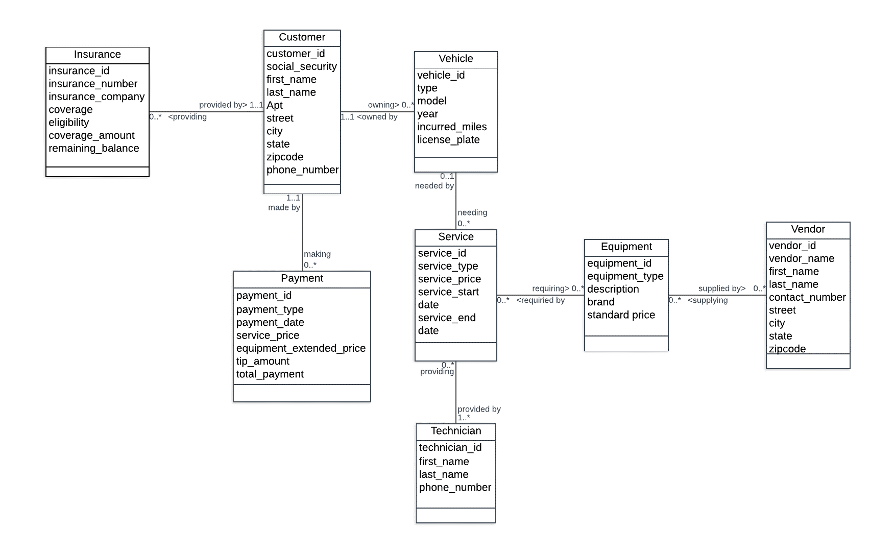
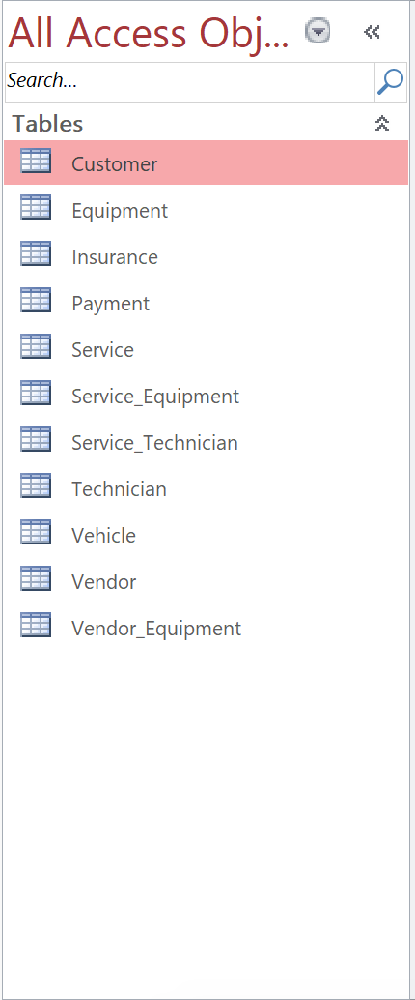
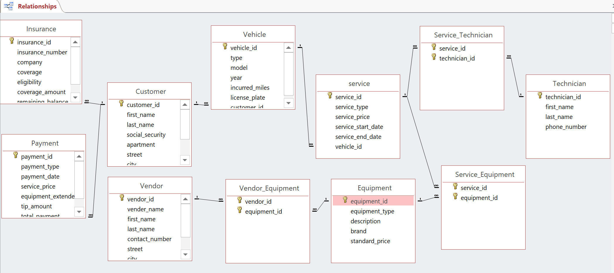
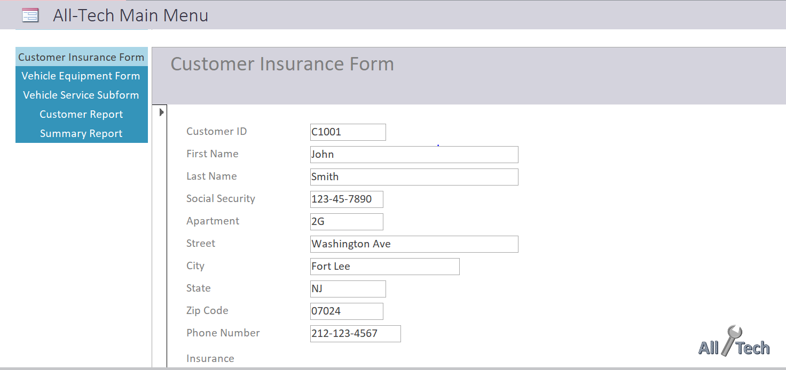
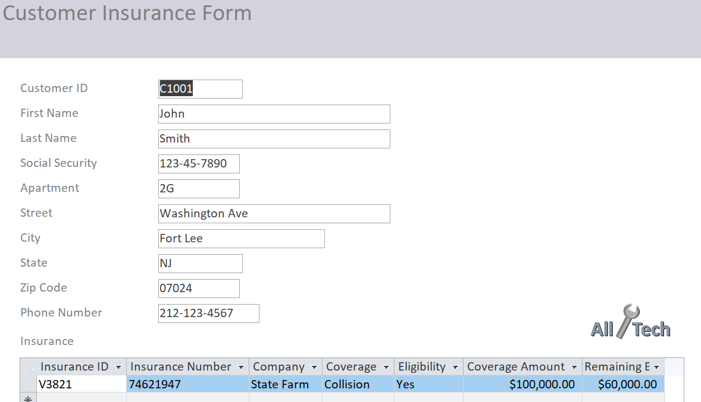
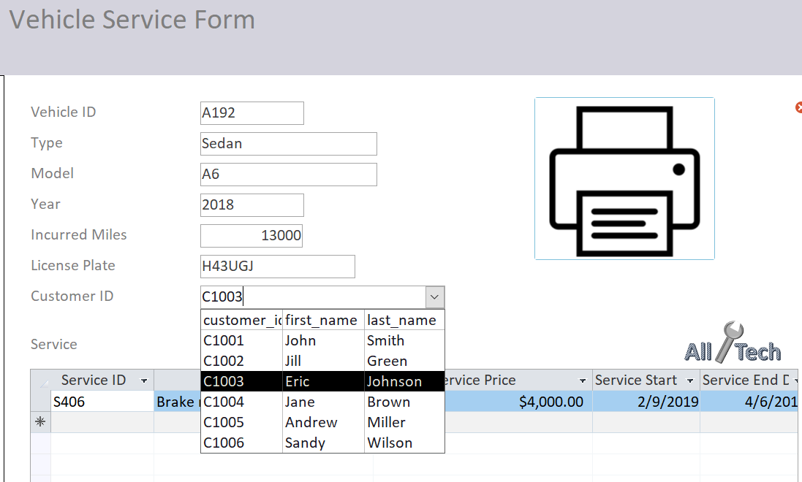
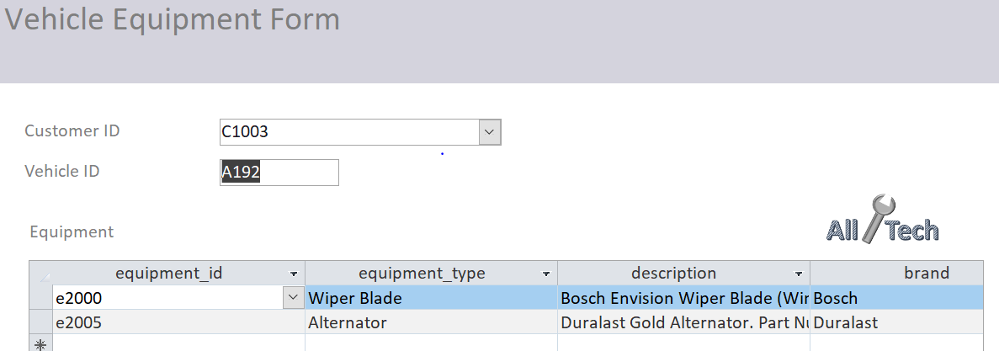
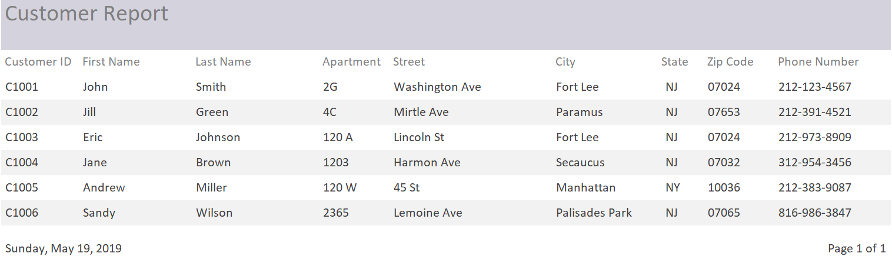
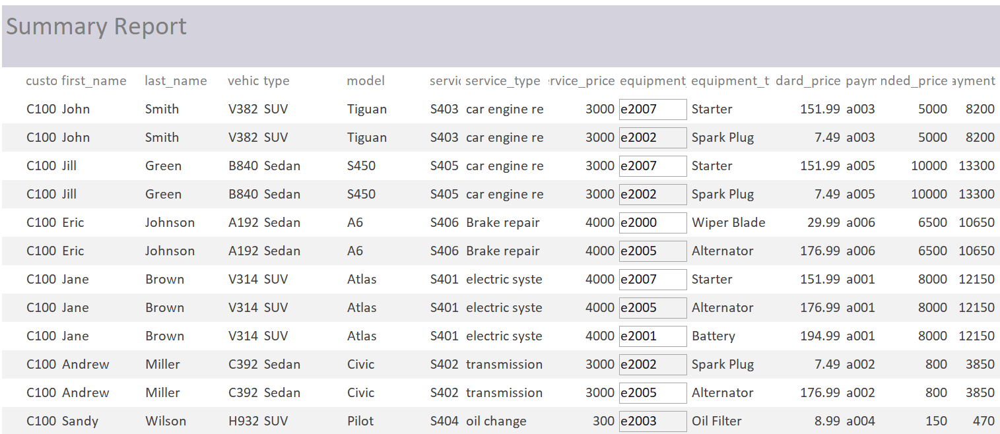

# All Tech
### THE AUTO REPAIR SHOP DATABASE PROJECT

**CIS 3400 - Database Management Systems**

**Authors**
1. Eric Wong
2. Sujin Lim
3. Jingwei Dong
4. Mengxing Dong

---

### I. Business Scenario
An auto repair shop named All-Tech just opened its business in Fort Lee, New Jersey and offers 
services to any customers who would like to fix or reform their cars. The services and prices will differ 
depending on the car type, model, year, incurred miles, etc. and the types of equipment needed for a 
repair. Customers will have the choice of choosing their preferred equipment or parts, such as the brand of 
a tire and/or other materials. The auto repair shop employs many technicians skilled in various types of 
repairs (for example http://atlcarrepair.com/services/). The business also accepts a handful of insurance 
plans from their customers. Each customer might have different coverages and the shop is required to 
check the deductible, eligibility, coverage amount, and remaining balances of the insurance. Due to the 
various types of services provided, there are many different suppliers in which the shop is contracting for 
materials. The business strives to offer the best services to its customers, so all customer information will 
be managed by the shop. This, in turn, will increase the profit gained from utilizing customer eligible 
insurances, more reasonable pricing of materials with suppliers, higher retainment rate of existing 
customers, and an increase in new customer traction.

Our strategy applies database management systems to store and keep track of information. In 
addition, it maximizes our productivity by saving space and time spent on ordering new and reducing 
remaining equipment. Our techniques also aid in minimizing redundant information and allows us to 
make smart business decisions, such as expanding our workforce or finding alternative suppliers.

---

### II. ER Model using UML Notation



**Relationship Sentences:**

One **Customer** *may be* **providing** *one or more* **Insurance**. </br>
One **Insurance** *must be* **provided by** *one and only one* **Customer**. </br>
</br>
One **Customer** *may be* **making** *one or more* **Payment**. </br>
One **Payment** *must be* **made by** *one and only one* **Customer**. </br>
</br>
One **Customer** *must be* **owning** *one or more* **Vehicle**.
One **Vehicle** *must be* **owned by** *one and only one* **Customer**. </br>
</br>
One **Vehicle** *may be* **needing** *one or more* **Service**. </br>
One **Service** *may be* **needed by** *one and only one* **Vehicle**. </br>
</br>
One **Service** *must be* **provided by** *one or more* **Technician**. </br>
One **Technician** *may be* **providing** *one or more* **Service**. </br>
</br>
One **Service** *may be* **requiring** *one or more* **Equipment**. </br>
One **Equipment** *may be* **required by** *one or more* **Service**. </br>
</br>
One **Equipment** *may be* **supplied by** *one or more* **Vendor**. </br>
One **Vendor** *may be* **supplying** *one or more* **Equipment**. </br>

---

### III. Conversion to Relational Model

**Initial Set of Relations:**

- **Customer** (customer_id(key), social_security, first_name, last_name, Apartment, street, city, state, zipcode, phone_number)

- **Insurance** (insurance_id(key), insurance_number,  insurance_company, coverage, eligibility, coverage_amount, remaining_balance, customer_id(fk))

- **Payment** (payment_id(key), payment_type, payment_date, service_price, equipment_extended_price, tip_amount, total_payment, customer_id(fk))

- **Vehicle** (vehicle_id(key), type, model, year, incurred_miles, license_plate, customer_id(fk))

- **Service** (service_id(key), service_type, service_price, service_start_date, service_end_date, vehicle_id(fk))

- **Technician** (technician_id(key), first_name, last_name, phone_number)

- **Service_Technician** (service_id(fk)(key), technician_id(fk)(key))

- **Equipment** (equipment_id(key), equipment_type, description, brand, standard_price)

- **Service_Equipment** (service_id(fk)(key), equipment_id(fk)(key))

- **Vendor** (vendor_id(key), vendor_name, first_name, last_name, contact_number, street, city, state, zipcode)

- **Vendor_Equipment** (vendor_id(fk)(key), equipment_id(fk)(key))

---

### IV. Normalization

**Brief Discussion**

For normalization, we go through the definitions of each normal form starting with 1NF and going up to 3NF. If a relation meets the definition of a normal form, then we move up to the next higher normal form. If a relation fails to meet the definition of a normal form, like containing a partial-key dependency a transitive dependency, then we split the relation into two new relations.

**Customer Relation**

Customer (customer_id(key), social_security, first_name, last_name, Apartment, street, city, state, zipcode, phone_number)
>Key: customer_id </br>
>FD1: customer_id → first_name, last_name, Apartment, street, city, state, zipcode, phone_number, social_security </br>
>FD2: zipcode → state, city </br>
-	1NF: Yes. It meets the definitions of a relation 
-	2NF: Yes. There’s no partial dependency
-	3NF: No. there’s transitive dependency in FD2

*...Split FD2 into ZipCodes & CustomerData*

ZipCodes(zipcode, state, city) </br>
>Key: zipcode </br>
>FD1: zipcode →  state, city </br>
-	1NF: Yes It meets the definitions of a relation
-	2NF: Yes there’s no partial dependency
-	3NF: Yes. There’s no transitive dependency

CustomerData(zipcode, customer_id, first_name, last_name, apartment, street, phone_number, social_security) </br>
>Key: customer_id 	foreign key: zipcode </br>
>FD1: customer_id →  first_name, last_name, apartment, street, phone_number, social_security, zipcode </br>
-	1NF: Yes. It meets the definitions of a relation
-	2NF: Yes. There’s no partial dependency
-	3NF: Yes. There’s no transitive dependency
</br>

**Insurance Relation**

Insurance (insurance_id(key), insurance_number,  insurance_company, coverage, eligibility, coverage_amount, remaining_balance, customer_id(fk)) </br>
>Key: insurance_id </br>
>FD1: insurance_id→ insurance_number,  insurance_company, coverage, eligibility, coverage_amount, remaining_balance, customer_id </br>
-	1NF: Yes. It meets the definitions of a relation.
-	2NF: Yes. There’s no partial key dependency.
-	3NF: Yes. There’s no transitive dependency.
</br>

**Payment Relation**

Payment (payment_id(key), payment_type, payment_date, service_price, equipment_extended_price, tip_amount, total_payment, customer_id(fk)) </br>
>Key: payment_id </br>
>FD1: payment_id → payment_type, payment_date, service_price, equipment_extended_price, tip_amount, total_payment, customer_id </br>
-	1NF: Yes. It meets the definitions of a relation.
-	2NF: Yes. There’s no partial key dependency.
-	3NF: Yes. There’s no transitive dependency.
</br>

**Vehicle Relation**

Vehicle (vehicle_id(key), type, model, year, incurred_miles, license_plate, customer_id(fk)) </br>
>Key: vehicle_id	foreign key: customer_id </br>
>FD1: vehicle_id → type, model, year, incurred_miles, license_plate, customer_id </br>
-	1NF: Yes. It meets the definitions of a relation 
-	2NF: Yes. There’s no partial key dependency.
-	3NF: Yes. There’s no transitive dependency
</br>

**Service Relation**

Service (service_id(key), service_type, service_price, service_start, date, service_end date, vehicle_id(fk)) </br>
>Key: service_id	foreign key: vehicle_id </br>
>FD1: service_id→  service_type, service_price, service_start, date, service_end date, vehicle_id </br>
-	1NF: Yes. It meets the definitions of a relation.
-	2NF: Yes. There’s no partial key dependency.
-	3NF: Yes. There’s no transitive dependency.
</br>

**Technician Relation**

Technician (technician_id(key), first_name, last_name, phone_number) </br>
>Key: technician_id </br>
>FD1: technician_id → first_name, last_name, phone_number </br>
-	1NF: Yes. It meets the definitions of a relation.
-	2NF: Yes. There’s no partial key dependency.
-	3NF: Yes. There’s no transitive dependency.
</br>

**Service_Technician Relation**

Service_Technician (service_id(fk)(key), technician_id(fk)(key)) </br>
>Key: service_id, technician_id </br>
-	1NF:  yes, because it is a relation with a key.
-	2NF:  yes, because it is "all key".
-	3NF:  yes, because it is "all key".
</br>

**Equipment Relation**

Equipment (equipment_id(key), equipment_type, description, brand, standard price)
>Key: equipment_id
>FD1 equipment_id →  equipment_type, description, brand, standard price
-	1NF: Yes. It meets the definitions of a relation.
-	2NF: Yes. There’s no partial key dependency.
-	3NF: Yes. There’s no transitive dependency.
</br>

**Service_Equipment Relation**

Service_Equipment (service_id(fk)(key), equipment_id(fk)(key)) </br>
>Key: service_id, equipment_id </br>
-	1NF:  yes, because it is a relation with a key.
-	2NF:  yes, because it is "all key".
-	3NF:  yes, because it is "all key".
</br>

**Vendor Relation**

Vendor (vendor_id(key), vendor_name, first_name, last_name, contact_number, street, city, state, zipcode) </br>
>Key: vendor_id </br>
>FD1: vendor_id →  vendor_name, first_name, last_name, contact_number, street, city, state, zipcode </br>
>FD2: zipcode →  city, state </br>
-	1NF: Yes.
-	2NF: Yes. There’s no partial dependency.
-	3NF: No. There’s transitive dependency.

*...Split FD2 into VendorData & ZipCode*

VendorData (vendor_id, zipcode, vendor_name, first_name, last_name, contact_number, street) </br>
>Key: vendor_id 	foreign key: zipcode </br>
>FD1: vendor_id →  vendor_name, first_name, last_name, contact_number, zipcode </br>
-	1NF: Yes. It meets the definitions of a relation.
-	2NF: Yes. There’s no partial key dependency.
-	3NF: Yes. There’s no transitive dependency.

ZipCodes (zipcode, city, state) </br>
>Key: zipcode </br>
>FD1: zipcode → city, state </br>
-	1NF: Yes. It meets the definitions of a relation.
-	2NF: Yes. There’s no partial key dependency.
-	3NF: Yes. There’s no transitive dependency.
</br>

**Vendor_Equipment Relation**

Vendor_Equipment (vendor_id(fk)(key), equipment_id(fk)(key)) </br>
>Key: vendor_id, equipment_id </br>
-	1NF:  yes, because it is a relation with a key.
-	2NF:  yes, because it is "all key".
-	3NF:  yes, because it is "all key".
</br>


**Final Set of Relations**

- **Customer** (customer_id(key), social_security, first_name, last_name, Apartment, street, city, state, zipcode, phone_number)

- **Insurance** (insurance_id(key), insurance_number,  insurance_company, coverage, eligibility, coverage_amount, remaining_balance, customer_id(fk))

- **Payment** (payment_id(key), payment_type, payment_date, service_price, equipment_extended_price, tip_amount, total_payment, customer_id(fk))

- **Vehicle** (vehicle_id(key), type, model, year, incurred_miles, license_plate, customer_id(fk))

- **Service** (service_id(key), service_type, service_price, service_start_date, service_end_date, vehicle_id(fk))

- **Technician** (technician_id(key), first_name, last_name, phone_number)

- **Service_Technician** (service_id(fk)(key), technician_id(fk)(key))

- **Equipment** (equipment_id(key), equipment_type, description, brand, standard_price)

- **Service_Equipment** (service_id(fk)(key), equipment_id(fk)(key))

- **Vendor** (vendor_id(key), vendor_name, first_name, last_name, contact_number, street, city, state, zipcode)

- **Vendor_Equipment** (vendor_id(fk)(key), equipment_id(fk)(key))

---

### V. Creating the Database Schema using SQL

**Creating Tables**

```SQL
CREATE TABLE Customer
(
    customer_id   VARCHAR(10) NOT NULL,
    first_name    VARCHAR(35),
    last_name     VARCHAR(35),
    social_security    VARCHAR(12),
    apartment   VARCHAR(12),
    street       VARCHAR(35),
    city           VARCHAR (25),
    state         VARCHAR(10),
    ZipCode       VARCHAR(12),
    PhoneNumber  VARCHAR(15)
);
CREATE TABLE Insurance
(
    insurance_id   VARCHAR(10) NOT NULL,
    insurance_number    VARCHAR(35),
    company     VARCHAR(35),
    coverage    VARCHAR(12),
    eligibility   VARCHAR(12),
    coverage_amount       NUMBER,
    remaining_balance           NUMBER,
    customer_id         VARCHAR(10) NOT NULL
);
CREATE TABLE Payment
(
    payment_id   VARCHAR(10) NOT NULL,
    payment_type    VARCHAR(35),
    payment_date    DATE,
    service_price    NUMBER,
    equipment_extended_price       NUMBER,
    tip_amount           NUMBER,
    total_payment       NUMBER,
    customer_id         VARCHAR(10) NOT NULL
);
CREATE TABLE Vehicle
(
    vehicle_id   VARCHAR(10) NOT NULL,
    type    VARCHAR(35),
    model    VARCHAR(35),
    year    VARCHAR(10),
    incurred_miles       NUMBER,
    license_plate           VARCHAR(35),
    customer_id         VARCHAR(10) NOT NULL
);
CREATE TABLE Service
(
    service_id   VARCHAR(10) NOT NULL,
    service_type    VARCHAR(35),
    service_price    NUMBER,
    service_start_date    DATE,
    service_end_date       DATE,
    vehicle_id         VARCHAR(10) NOT NULL
);
CREATE TABLE Technician
(
    technician_id   VARCHAR(10) NOT NULL,
    first_name    VARCHAR(35),
    last_name    VARCHAR(35),
    phone_number    VARCHAR(15)
);
CREATE TABLE Service_Technician
(
    service_id   VARCHAR(10) NOT NULL,
    technician_id   VARCHAR(10) NOT NULL
);
CREATE TABLE Equipment
(
    equipment_id   VARCHAR(10) NOT NULL,
    equipment_type    VARCHAR(35),
    description    VARCHAR(100),
    brand    VARCHAR(50),
    standard_price   NUMBER
);
CREATE TABLE Service_Equipment
(
    service_id   VARCHAR(10) NOT NULL,
    equipment_id   VARCHAR(10) NOT NULL
);
CREATE TABLE Vendor
(
    vendor_id   VARCHAR(10) NOT NULL,
    vendor_name   VARCHAR(50),
    first_name    VARCHAR(35),
    last_name     VARCHAR(35),
    contact_number   VARCHAR(15),
    street       VARCHAR(35),
    city           VARCHAR (25),
    state         VARCHAR(10),
    zipcode      VARCHAR(12)
);


CREATE TABLE Vendor_Equipment
(
    vendor_id   VARCHAR(10) NOT NULL,
    equipment_id   VARCHAR(10) NOT NULL
);
```

**Adding Primary Keys**
```SQL
ALTER TABLE Customer
   ADD CONSTRAINT pk_customer
    PRIMARY KEY (customer_id) ;
ALTER TABLE Insurance
   ADD CONSTRAINT pk_insurance
    PRIMARY KEY (insurance_id) ;
ALTER TABLE Payment
   ADD CONSTRAINT pk_payment
    PRIMARY KEY (payment_id) ;
ALTER TABLE Vehicle
   ADD CONSTRAINT pk_vehicle
    PRIMARY KEY (vehicle_id) ;
ALTER TABLE Service
   ADD CONSTRAINT pk_service
    PRIMARY KEY (service_id) ;
ALTER TABLE Technician
   ADD CONSTRAINT pk_technician
    PRIMARY KEY (technician_id) ;
ALTER TABLE Service_Technician
   ADD CONSTRAINT pk_service_technician
    PRIMARY KEY (service_id,technician_id) ;
ALTER TABLE Equipment
   ADD CONSTRAINT pk_equipment
    PRIMARY KEY (equipment_id) ;
ALTER TABLE Service_Equipment
   ADD CONSTRAINT pk_service_equipment
    PRIMARY KEY (service_id,equipment_id) ;

ALTER TABLE Vendor
   ADD CONSTRAINT pk_vendor
    PRIMARY KEY (vendor_id) ;
ALTER TABLE Vendor_Equipment
   ADD CONSTRAINT pk_vendor_equipment
    PRIMARY KEY (vendor_id, equipment_id) ;
```

**Adding Foreign Keys**
```SQL
ALTER TABLE Insurance
   ADD CONSTRAINT fk_insurance_customer
     FOREIGN KEY (customer_id) 
        REFERENCES Customer (customer_id);
ALTER TABLE Payment
   ADD CONSTRAINT fk_payment_customer
     FOREIGN KEY (customer_id) 
        REFERENCES Customer (customer_id);
ALTER TABLE Vehicle
   ADD CONSTRAINT fk_vehicle_customer
     FOREIGN KEY (customer_id) 
        REFERENCES Customer (customer_id);
ALTER TABLE Service
   ADD CONSTRAINT fk_service_vehicle
     FOREIGN KEY (vehicle_id) 
        REFERENCES Vehicle (vehicle_id);
ALTER TABLE Service_Technician
   ADD CONSTRAINT fk_service_technician_service
     FOREIGN KEY (service_id) 
        REFERENCES Service (service_id);
ALTER TABLE Service_Technician
   ADD CONSTRAINT fk_service_technician_technician
     FOREIGN KEY (technician_id) 
        REFERENCES Technician (technician_id);
ALTER TABLE Service_Equipment
   ADD CONSTRAINT fk_service_equipment_service
     FOREIGN KEY (service_id) 
        REFERENCES service (service_id);
ALTER TABLE Service_Equipment
   ADD CONSTRAINT fk_service_equipment_equipment
     FOREIGN KEY (equipment_id) 
        REFERENCES Equipment(equipment_id);
ALTER TABLE Vendor_Equipment
   ADD CONSTRAINT fk_vendor_equipment_vendor
     FOREIGN KEY (vendor_id) 
        REFERENCES Vendor(vendor_id);
ALTER TABLE Vendor_Equipment
   ADD CONSTRAINT fk_vendor_equipment_equipment
     FOREIGN KEY (equipment_id) 
        REFERENCES Equipment(equipment_id);
```

**Database Schema**



**Relationship View**



---

### VI. Database Application

**Navigation Form**



**Customer Data Entry Form**



**Back-End Logic using VBA**

```VBA
Private Sub first_name_AfterUpdate()
'convert words to proper case
    first_name = StrConv(first_name, vbProperCase)
End Sub

Private Sub last_name_AfterUpdate()
'convert words to proper case
    last_name = StrConv(last_name, vbProperCase)
End Sub

Private Sub Street_AfterUpdate()
'convert words to proper case
    street = StrConv(street, vbProperCase)
End Sub

Private Sub City_AfterUpdate()
'convert words to proper case
    city = StrConv(city, vbProperCase)
End Sub

Private Sub State_AfterUpdate()
'convert words to proper case
    state = UCase(state)
End Sub

Private Sub Apartment_AfterUpdate()
'convert words to proper case
    apartment = UCase(apartment)
End Sub
```

**Service Data Entry Form**



**Equipment Data Entry Form**



**Customer Report**




**Summary Report**



---
